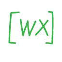
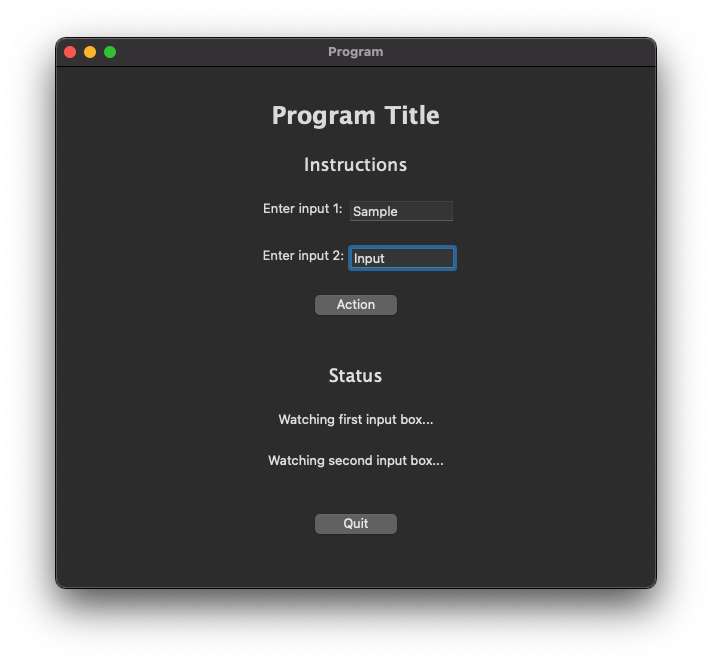
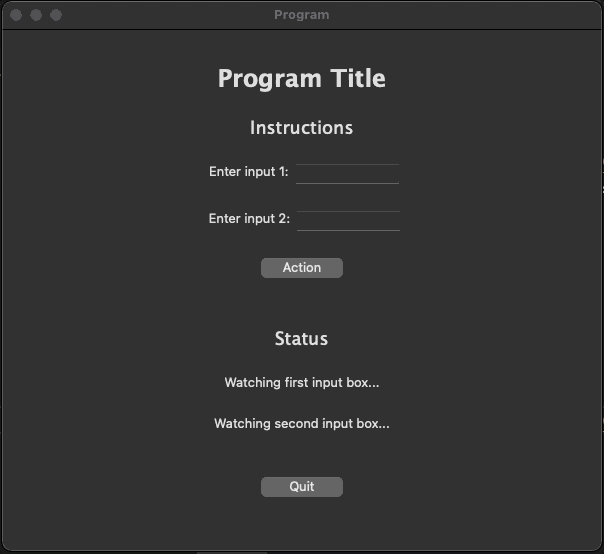

<!--
*** Thanks for checking out this project. If you have a suggestion
*** that would make this better, please fork the repo and create a pull request
*** or simply open an issue with the tag "enhancement".
***
-->


<!-- PROJECT LOGO -->
<br />
<p align="center">
  <a href="https://github.com/reoyamanaka/wxBoilerplate.git">
    
  </a>

  <h3 align="center">wxBoilerplate</h3>

  <p align="center">
    Boilerplate code for a wxPython project.
    <br />
    <a href="https://github.com/reoyamanaka/wxBoilerplate"><strong>Explore the docs »</strong></a>
    <br />
    <br />
    <a href="#usage">View Demo</a>
    ·
    <a href="https://github.com/reoyamanaka/wxBoilerplate/issues">Report Bug</a>
    ·
    <a href="https://github.com/reoyamanaka/wxBoilerplate/issues">Request Feature</a>
  </p>
</p>


<!-- TABLE OF CONTENTS -->
<details open="open">
  <summary><h2 style="display: inline-block">Table of Contents</h2></summary>
  <ol>
    <li>
      <a href="#about-the-project">About The Project</a>
      <ul>
        <li><a href="#built-with">Built With</a></li>
      </ul>
    </li>
    <li>
      <a href="#getting-started">Getting Started</a>
      <ul>
        <li><a href="#prerequisites">Prerequisites</a></li>
        <li><a href="#installation">Installation</a></li>
      </ul>
    </li>
    <li><a href="#usage">Usage</a></li>
    <li><a href="#roadmap">Roadmap</a></li>
    <li><a href="#contributing">Contributing</a></li>
    <li><a href="#license">License</a></li>
    <li><a href="#contact">Contact</a></li>
  </ol>
</details>


<!-- ABOUT THE PROJECT -->
## About The Project

This is a boilerplate wxPython project that can be easily customized for specific purposes.

<p align="left">
  
</p>

### Built With

* macOS Big Sur Version 11.4
* Adobe Illustrator Version 23.1 (Logo design)
* Python 3.9.5

<!-- GETTING STARTED -->
## Getting Started

To get a local copy up and running follow these simple steps.

### Prerequisites

* wxPython
  ```sh
  pip install wxPython
  ```

### Installation

1. Clone the repo
   ```sh
   git clone https://github.com/reoyamanaka/wxBoilerplate.git
   ```
2. Install requirements
   ```sh
   pip install -r requirements.txt
   ```


<!-- USAGE -->
## Usage




<!-- ROADMAP -->
## Roadmap

See the [open issues](https://github.com/reoyamanaka/wxBoilerplate/issues) for a list of proposed features (and known issues).


<!-- CONTRIBUTING -->
## Contributing

Contributions are what make the open source community such an amazing place to be learn, inspire, and create. Any contributions you make are **greatly appreciated**.

1. Fork the Project
2. Create your Feature Branch (`git checkout -b feature/AmazingFeature`)
3. Commit your Changes (`git commit -m 'Add some AmazingFeature'`)
4. Push to the Branch (`git push origin feature/AmazingFeature`)
5. Open a Pull Request


<!-- LICENSE -->
## License

Distributed under the GNU Affero General Public License v3.0 License. See `LICENSE` for more information.


<!-- CONTACT -->
## Contact

Reo Yamanaka - [LinkedIn](https://www.linkedin.com/in/reo-yamanaka-7a2289119/) - [My YouTube channel](https://www.youtube.com/channel/UCBwqp_MEM2XcSnq7kRvOB3A) - ryamanaka807@gmail.com

Project Link: [https://github.com/reoyamanaka/wxBoilerplate.git](https://github.com/reoyamanaka/wxBoilerplate.git)
